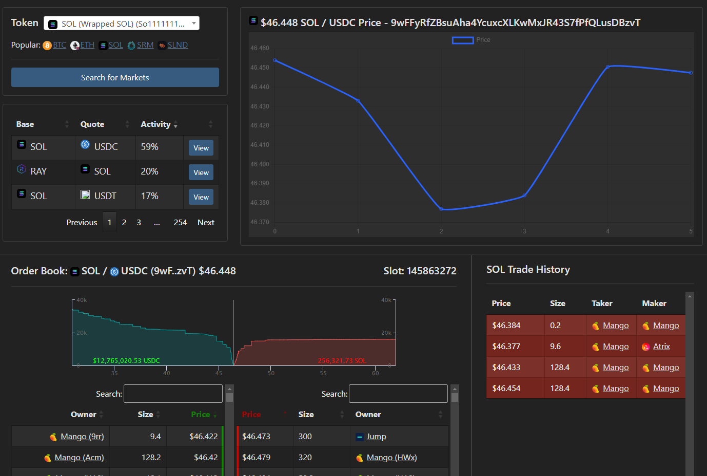

# serum-data
A web interface for viewing market data from [Project Serum](https://www.projectserum.com/), on the Solana blockchain.

For version 2.0 and greater, `serum-data` uses a Geyser + Postgres-based data source.

Version 1.X and the `rpc` branch will be maintained for a simple, portable interface to run locally, without any database or validator dependencies, and can run on a public RPC.



## Building
### Requirements
* Java 17

### Building with Maven
```
mvn clean install
```

## Running in Docker container (RPC Version)
```
docker pull mmorrell/serum-data:latest-rpc
docker run -p 8080:8080 serum-data
```

## Running in Docker container (self-build)
```
docker build -t serum-data .
docker run -p 8080:8080 serum-data
```

### Geyser Configuration
- For version 2.0 and beyond, `serum-data` **requires** a Postgres-backed data source instead of standard Solana RPC.
- You will need to run the `serum-db` API server, pointed to a Postgres database, being streamed in all Serum v3 
  accounts.
- `serum-db` can be found here: [https://github.com/skynetcap/serum-db](https://github.com/skynetcap/serum-db)
- It is ran using the included Dockerfile on port `8082` on the same host as this application.
- `docs/accounts_export.csv` can be used to load the 4 required accounts for SOL/USDC, the bare minimum needed 
  for a local testing environment.
- Note: Using the Geyser Postgres plugin requires a very high-end server.

## Special Thanks
YourKit for providing us with a free profiler open source license.

YourKit supports open source projects with innovative and intelligent tools
for monitoring and profiling Java and .NET applications.
YourKit is the creator of <a href="https://www.yourkit.com/java/profiler/">YourKit Java Profiler</a>,
<a href="https://www.yourkit.com/.net/profiler/">YourKit .NET Profiler</a>,
and <a href="https://www.yourkit.com/youmonitor/">YourKit YouMonitor</a>.


## Contributing
Open an issue with details, or pull request with changes.

## License
MIT License